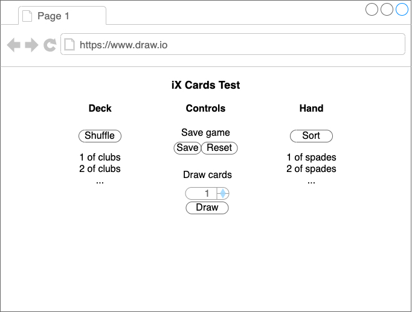

# 🃏 Deck of Cards

Given the user story below, create an app with the described functionality.

> **As a** magician, **I want** to be able to shuffle, draw and sort cards **so that** I can perform magic tricks.

We expect submissions to be built with React, or React Native using either JavaScript or TypeScript.

## Acceptance criteria

### AC 1 - Shuffle the deck

- Given there are cards in the deck,
- When I click "Shuffle",
- Then the deck should be randomly shuffled.

### AC 2 - Draw cards from the deck

- Given there are cards in the deck,
- When I click "Draw",
- Then a specified a number of cards should be moved from the deck into my hand.

### AC 3 - Sort cards in my hand

- Given there are cards in my hand,
- When I click "Sort",
- Then my hand should be sorted by:
  - Suit in order: Clubs, Spades, Hearts, Diamonds;
  - Value low to high (Aces are high);

### AC 4 - Save local games [Extra credit]

Save

- Given I have shuffled and drawn cards and clicked "save",
- When I refresh the page,
- Then I can resume from my previous state.

Reset

- Given I have saved a game state,
- When I click "reset",
- Then the game resets with all the cards moved to the deck.

## Technical considerations

### 📱 User interface

Real-world user stories would usually include a link to a high fidelity design file. For this exercise, a simple interface is fine. See below for an example.

If you want to do more, we'd love to see what you're capable of!

### 🍽 Boilerplate code

We're not looking to test your knowledge of front-end build tools in this exercise, so feel free to use a starter boilerplate of your choice as a baseline (create-react-app etc.)

### 🧪 Testing

At iX, we champion test-driven-development (TDD).

To keep this exercise simple and respect your time, we ask that you only provide tests for **one React component**, and **one pure JS function** that sorts the cards in your hand.

### 📚 Open-source libraries

Feel free to use open-source libraries where you feel their use is justified.

### ✅ Best practices

Code should be well written and consistently structured, with modern best practices considered to in all aspects across HTML, JS, CSS and React, including accessibility concerns.

## Submission format

Please provide documentation on how to test and run your code.

Your submission should be a **link to a GitHub repo** with the completed challenge on the main branch. If you can share a link to a hosted version of the site, that would be a bonus.

It took us around **90 minutes** to create our exemplar solution to the exercise. Use this as an indicator of how much time to spend on it.

We expect that the code should work, but mostly we want to see what you think "good" looks like.

Thanks, and **good luck**! 🎉
